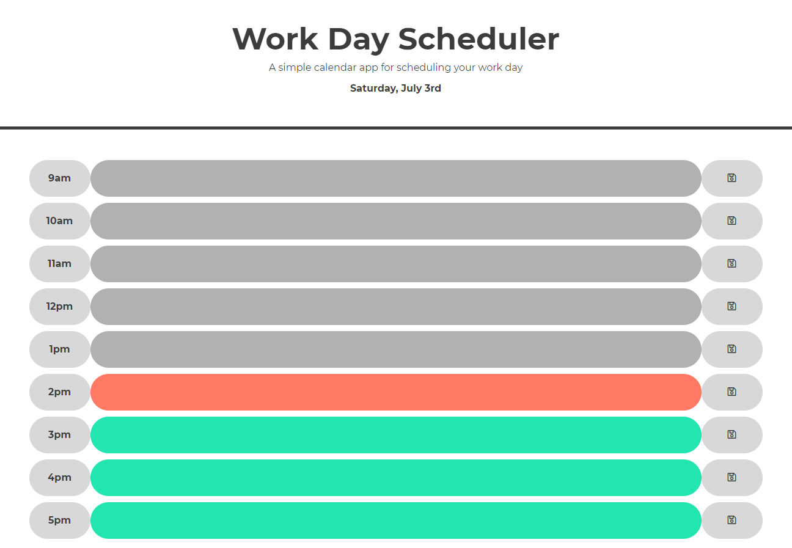

# Day-planner

Link to Github repository: https://github.com/LewisChatham/day-planner
Link to live site: https://lewischatham.github.io/day-planner/

## Description
My motivation for working on this work day planner is to work on re-usable code and trying to efficiently code solutions to problems.
The application serves to help organise a persons day by giving each hour to write events in.
The user can save their to do list to local storage.
I learnt a lot about dynamically creating elements on the page and having event listeners to handle events on those newly added HTML elements.

## Usage
To use the day-planner, open it up, and you will see todays date at the top.
You can plan events for that day in the calendar below the black line.
GREY blocks are times that have already occured, best not to plan for those.
The RED block is the current time.
And GREEN blocks are future times
The cycle repeats each week.
You can ADD events to these blocks by clicking on the middle of a row and typing what you need to do.
You can SAVE these events by clicking the save icon to the right of the input field.

## License
MIT License

Copyright (c) [year] [fullname]

Permission is hereby granted, free of charge, to any person obtaining a copy
of this software and associated documentation files (the "Software"), to deal
in the Software without restriction, including without limitation the rights
to use, copy, modify, merge, publish, distribute, sublicense, and/or sell
copies of the Software, and to permit persons to whom the Software is
furnished to do so, subject to the following conditions:

The above copyright notice and this permission notice shall be included in all
copies or substantial portions of the Software.

THE SOFTWARE IS PROVIDED "AS IS", WITHOUT WARRANTY OF ANY KIND, EXPRESS OR
IMPLIED, INCLUDING BUT NOT LIMITED TO THE WARRANTIES OF MERCHANTABILITY,
FITNESS FOR A PARTICULAR PURPOSE AND NONINFRINGEMENT. IN NO EVENT SHALL THE
AUTHORS OR COPYRIGHT HOLDERS BE LIABLE FOR ANY CLAIM, DAMAGES OR OTHER
LIABILITY, WHETHER IN AN ACTION OF CONTRACT, TORT OR OTHERWISE, ARISING FROM,
OUT OF OR IN CONNECTION WITH THE SOFTWARE OR THE USE OR OTHER DEALINGS IN THE
SOFTWARE.
